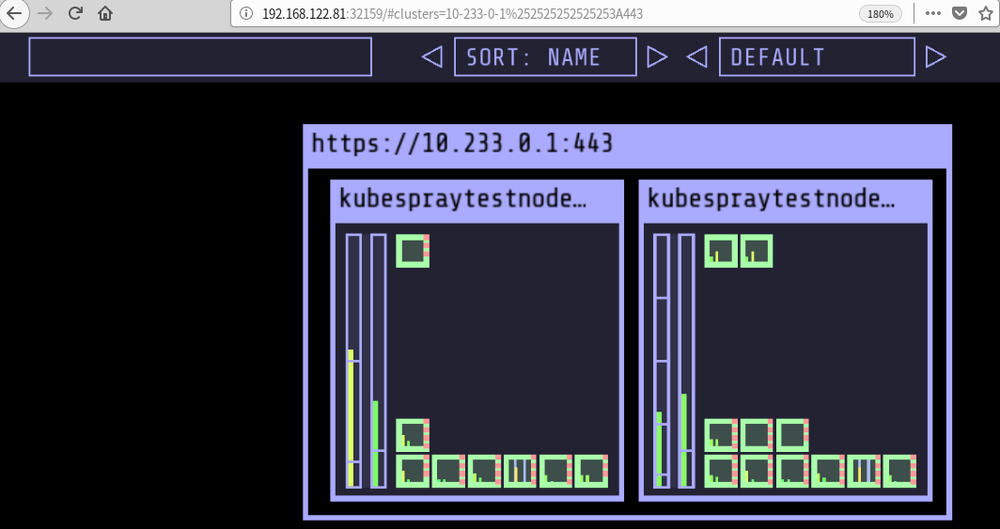

###k8s开发小工具telepresence

Telepresence 是一款开源工具，允许您在本地运行单个服务，同时将该服务连接到远程Kubernetes集群。这让开发人员在多服务应用程序上工作有以下好处:

* 快速本地开发单个服务，即使该服务依赖于集群中的其他服务。只需对服务进行更改，保存，您就可以立即看到新的服务运行的效果。
* 使用任何本地安装的工具来测试/调试/编辑您的服务。例如，您可以使用调试器或IDE
* 让您的本地开发机器运行起来，就好像它是Kubernetes集群的一部分一样。如果您的机器上有一个应用程序，您想要针对集群中的服务运行它——这很容易做到。

###k8s测试小工具chaoskube

chaoskube 可以周期性的杀死kubernetes环境的随机多个pod。
可以用于测试kubernetes对pod失败的容错性。

###k8s运维小工具kube-ops-view
Kubernetes Operational View - read-only system dashboard for multiple K8s clusters
Kubernetes Operational View - 可以对多个k8s集群查看关键组件信息的只读ui面板

目标:为多个Kubernetes集群提供一个通用的操作图。

* 渲染节点并显示其总体状态(“就绪”)
* 显示节点容量和资源使用情况(CPU、内存)
  * 每个CPU呈现一个“框”，并填满pod CPU请求/使用的总和
  * 呈现总内存的竖线，并填满pod内存请求/使用的总和
* 呈现个人pod
  * 用边框颜色表示pod状态(绿色:准备/运行，黄色:挂起，红色:错误等)
  * 显示当前CPU/内存使用情况(从Heapster中收集)
  * 系统pod(“kube-system”名称空间)将在底部分组

* 提供节点和pod的工具提示信息
* pod的创建和终止动画

它不是什么:

* 它不是Kubernetes仪表盘的替代品。Kubernetes Dashboard是一个通用UI，它允许管理应用程序。
* 这不是一个监控解决方案。使用您首选的监视系统对生产问题发出警报。
* 它不是一个操作管理工具。Kubernetes操作视图不允许与实际集群交互。

执行以下命令安装
```
git clone https://github.com/hjacobs/kube-ops-view.git
cd kube-ops-view/
kubectl apply -f deploy  # apply all manifests from the folder
```
注意
* 因为node和pod的cpu/内存使用量是从Heapster中收集，而新版的kubernetes废弃heapster。因此，使用量数据会收集不到。
* 界面有些简陋


